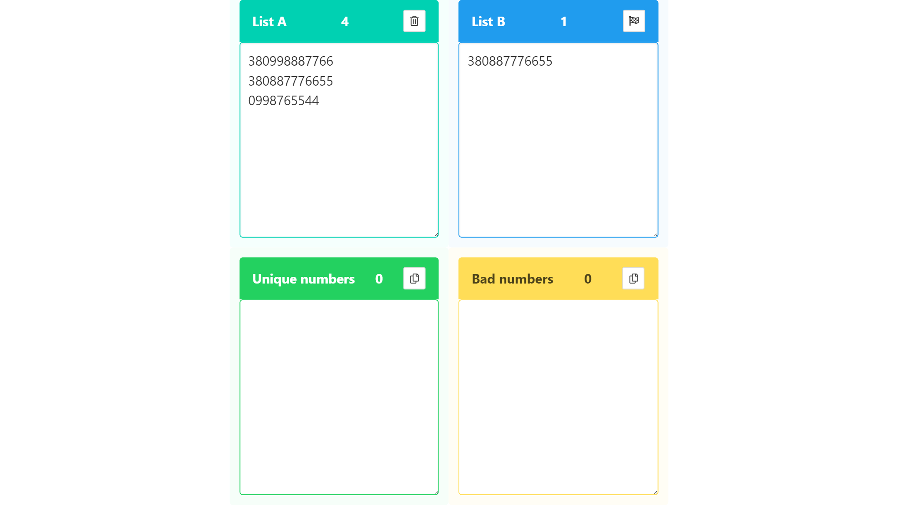
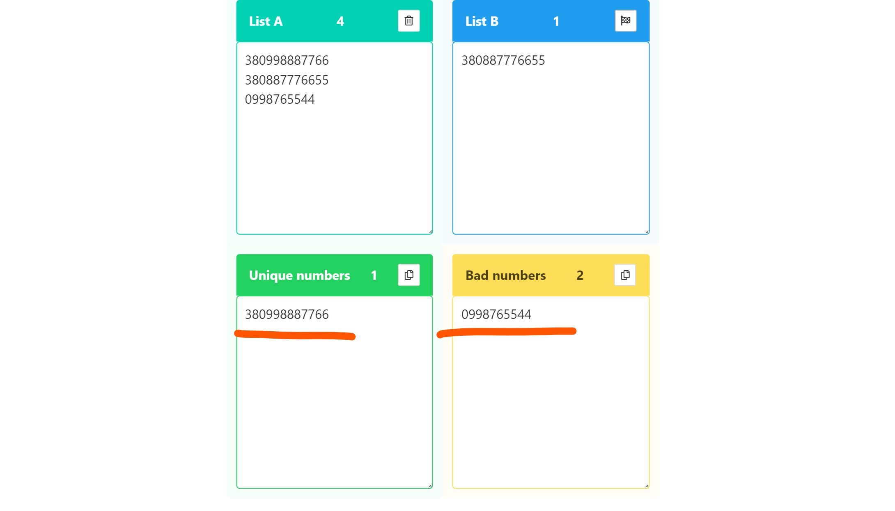

# Unique numbers checker
### [LINK](https://so2niko.github.io/tel-check/)

Service for selecting unique numbers from _two lists_.
Supports the ability to insert numbers.
Has the ability to work with a large number of numbers (tens of thousands) without overloading the interface.

- _Paste the main number base in **list A**._
- _In **list B**, paste the numbers you want to exclude from the main list_

- _To start, click on the button with the 🏁 flag._ 

- _The result is displayed in the lists below. It is possible to copy the entire list at once using the 📋 button_

